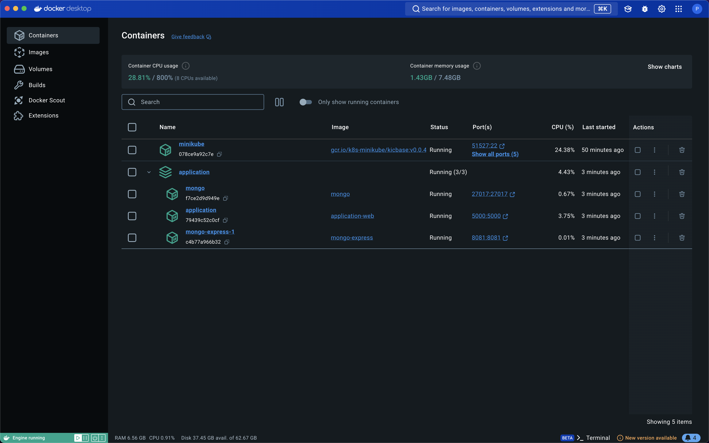
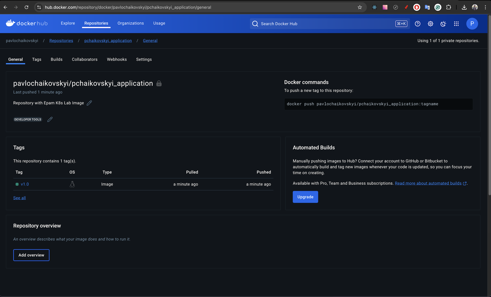
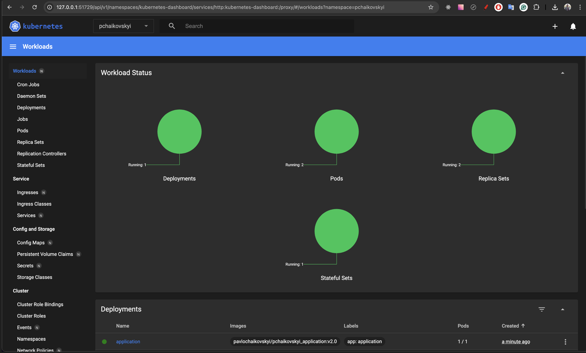
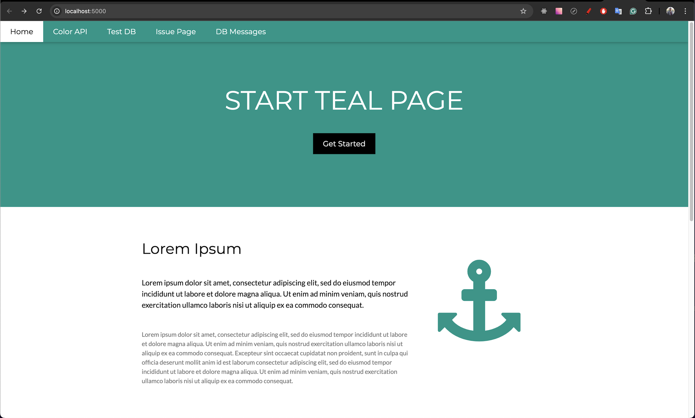

# Project Overview: 

Build the app's container image with Dockerfile, push it to private repository,  
test applicatoin on local environment using docker-compose.yaml,   
and then deploy application to local Kubernetes and pass the requirements

## Application Description
The application deployed in 3-tier layers:
- Presentation layer: Kubernetes NGINX Ingress
- Application layer: Flask application based on Docker image in Kubernetes pods
- Data layer: MongoDB based on Docker image in Kubernetes pods

### Steps

#### 1. Build Docker image and publish it to private Docker registry ( Docker-Hub )
  - Application source code is placed in /application directory
  - No Haskell Dockerfile linter errors or warnings

#### 2. Create docker-compose.yaml and deploy locally application

  - the application is deployed (we can open it in browser)
  - data can be written to MongoDB on *Test DB Connectivity* page

#### 3. Preparing Kubernetes manifest **manifest.yml** and deploy it to *local minikube* Kubernetes

  ##### Kubernetes manifest requirements:

- Deploy application layer (custom Docker image) based on *Deployment* and *Service*:
    - Docker credentials have been gotten from Kubernetes secret
    - Deployment name is *application*
    - Deployment label is *application*
    - Container name is *application*
    - Service name is *application*
    - Service port is *80*
    - Container port is *5000*
    - The number of replicas is *1*
    - Add liveness/readiness probe: liveness probe to path /healthz, readiness probe to path /healthx
    - Deploy strategy "Recreate"
    - Run application with next resources: CPU: limit-0.5 request-0.2, Memory: limit-128Mi request-64Mi
    - The deployment variables were obtained from the Kubernetes configmap *application*
    - Add init container to deployment of app: wait until the mongo is available and running
- Deploy data layer:
    - StatefullSet name is *mongo*
    - StatefullSet label is *mongo*
    - Container name is *mongo*
    - The number of replicas is *1*
    - Run StatefullSet with next resources:
        - CPU: limit-0.5 request-0.2
        - Memory: limit-256Mi request-128Mi
    - Mongo credentials have been gotten from Kubernetes secret mongo
    - Secret name is *mongo*
- Deploy presentation layers based on NGINX Ingress:
    - NGINX Ingress name is *nginx*
    - Host is `pchaikovskyi.application.com`
    - Port is *80*

### **Check Result:**
- the application is deployed in *local* Kubernetes
- the application is accessed through `pchaikovskyi.application.com` URL

### Used tools: 
- ####  Docker-Desktop, Docker-Compose, Docker-Hub, Dockerfile
- ####  Kubernetes : Secrets, ConfigMap, Namespaces, Service, Deployment, Replica Sets, Ingress, StatefulSet, Pods
- ####  Minikube : Dashboard, Addons
- ####  VS Code : Terminal
- ####  Git, GitHub, GitLab

